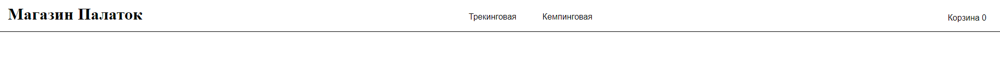
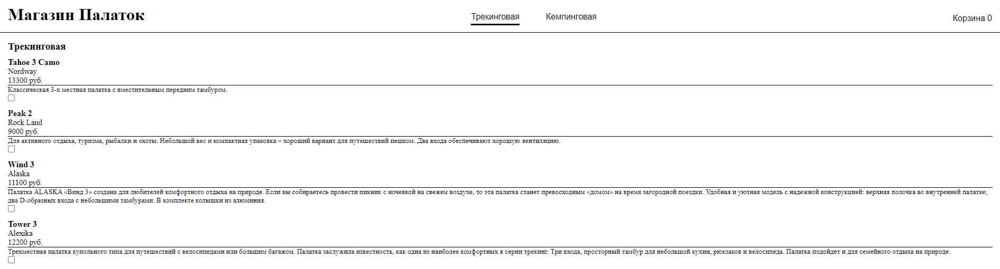
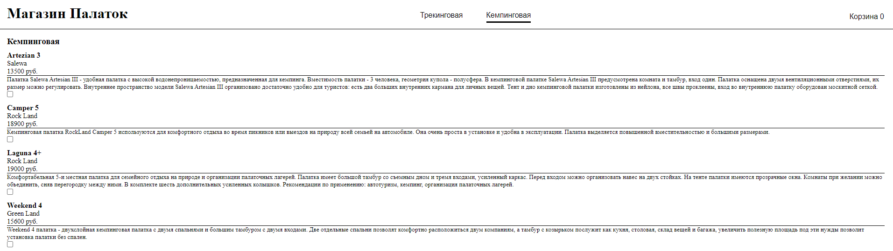
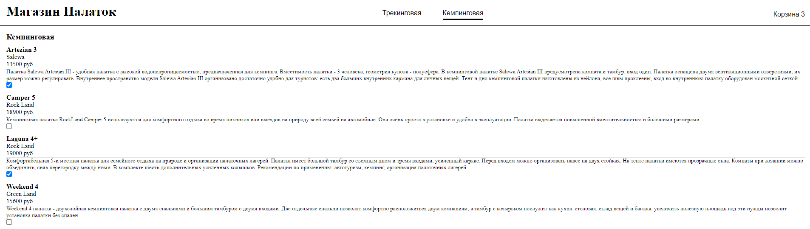
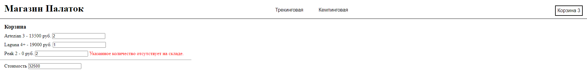

# Tent_Store_Basket
Реализация корзины магазина палаток с помощью асинхронного метода

На начальная страница отображены типы палаток:

При выборе типа открывается выбор палаток:

Чтобы занести палатку в корзину, нужно включить чекбокс рядом с нужным товаром:

В корзине будут отображаться все выбранные товары. У них можно указать количество и узнать общую стоимость. При выборе количества больше, чем хранится в БД, то выведется ошибка:

---

*02/2023 - 06/2023*
